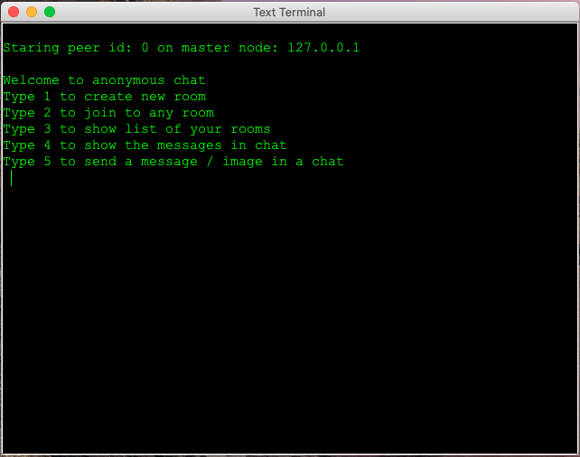

# Anonymous-Chat Peer-to-Peer Network


**Candidato** : *Dragone Raffaele*

**Matricola** : *0522500863*

**Anno Accademico** : *2020/2021*

**Architetture Distribuite per il Cloud**

# Sommario.

1. Presentazione della soluzione proposta

2. Tecnologie utilizzate

3. Esposizione della struttura del progetto

   3.1 Descrizione del codice

4. Test Cases

5. Dipendenze

6. Demo

7. Docker

#  1. Presentazione della soluzione proposta

Anonymous-chat è un programma di messaggistica istantanea peer-to-peer (p2p) anonimo. Ciò significa che in fase di avvio il programma non richiederà alcuna registrazione utente.

L'obiettivo principale dello sviluppo del progetto è fornire la privacy che si ottiene utilizzando l'anonimato, sfruttando una rete peer-to-peer.
Può essere utilizzato per la messaggistica istantanea e il trasferimento di immagini con supporto per chat private e chat di gruppo.

Sono state fornite delle api ben definite che consentono ad ogni utente di : 

1. Creare una nuova room ( L'utente che crea una room effettua anche una join implicita )
2. Entrare in una room esistente.
3. Lasciare una room.
4. Inviare messaggi testuali.

Oltre a tali funzionalità, ne sono state aggiunte ulteriori, quali : 

1. Creare una room temporizzata specificando il tempo in minuti.
2. Inviare messaggi contenenti immagini.

Inoltre, per dare una maggiore semplicità di utilizzo, oltre alla classica implementazione tramite console, è stata sviluppata una GUI in java swing.

Anonymous-chat fa utilizzo della DHT per memorizzare informazioni relative ad ogni chat creata, contenente oltre all'eventuale orario di scadenza , il numero di utenti che partecipano ad essa.

Per quanto riguarda l'invio dei messaggi all'interno di una chat, è stato implementato l'invio di messaggi diretti ad ogni utente della chat. 
In particolare, vengono distinti due casi : 

- Invio di messaggi testuali
- Invio di messaggi contenenti immagini

Per quanto riguarda l'invio di messaggi testuali, il sender non fa altro che prelevare la lista di utenti della specifica chat dalla DHT, ed inviare un direct message ad ogni utente.

Per quanto riguarda l'invio di messaggi contenenti immagini invece, al fine di sfruttare il potenziale della rete p2p e di non sovraccaricare troppo il sender con l'eventuale mole di ricevitori che potrebbe presentarsi, e' stato implementato un algoritmo che , distribuendo in modo equo il numero di immagini da inviare, rende partecipi un certo numero di ricevitori nella fase di invio della immagine stessa tramite un meccanismo di Forward dei messaggi.
In questo modo, l'utente che dovrà inviare una immagine non la invierà a tutti gli utenti di una chat in modo diretto, ma soltanto ad alcuni di essi, i quali provvederanno ad inoltrare l'immagine al restante numero di ricevitori.

#  2. Tecnologie utilizzate

- **Linguaggio di programmazione**: Java 8
- **DHT management**: TOM P2P v5.0
- **Software Project Management**: Apache Maven v.3.6.3
- **Containerization technology**: Docker v.19.03.13
- **Testing**: JUnit v4.11

#  3. Esposizione della struttura del progetto

Il progetto è strutturato in diversi package.

	1. beans.package
		1.1 Chat.java
		1.2 Message.java
		1.3 ImageWrapper.java
	2. chat.package
		2.1 AnonymousChatImpl.java
	3. gui.package
		3.1 ConsoleChat.java ( implementazione della chat tramite terminale )
		3.2 MainFrame.java ( implementazione della chat tramite GUI in swing)
		3.3 MessageRenderer.java ( renderer jlist swing)
	4. interfaces.package
		4.1 AnonymousChat.java
		4.2 MessageListener.java
	5. utils.package
		5.1 ImageCompressor.java (compressione jpeg per immagine, resize di una immagine)
		5.2 UtilDate.java (metodi utili al lavoro con le date come differenza in secondi tra due date)

Per implementare Anonymous-chat vengono utilizzati 3 beans : 

1. Chat
2. Message
3. ImageWrapper

### Chat.java

```java
public class Chat implements Serializable {
    private String roomName;
    private HashSet<PeerAddress> users;
    private Date endChat;
}
```

La classe Chat consente di creare un oggetto contenente le informazioni relative ad una chatroom. 
Essa infatti contiene il nome della stanza, l'hashset dei peer partecipanti alla chat, e l'eventuale data di scadenza.

Tale oggetto viene memorizzato all'interno della DHT, in modo tale da facilitare in fase di join o di invio di messaggi l'operazione stessa.

### Message.java

```java
public class Message implements Serializable{
    int type;
    String msg;
    String roomName;
    Date date;
    byte[] image;
    String name_file;
}
```

La classe Message contiene le informazioni relative ad uno specifico messaggio.
L'attributo type contraddistingue la tipologia di messaggio. Il suo valore sarà pari a 0 se il messaggio contiene del semplice testo, 1 se il messaggio contiene una immagine.

### ImageWrapper.java

```java
public class ImageWrapper implements Serializable{
    Message msg;
    private HashSet<PeerAddress> receivers;   
}
```

La classe ImageWrapper svolge un ruolo chiave durante l'invio di messaggi contenenti immagini.

Tale classe incapsula al suo interno un oggetto Message, ed aggiunge ad esso una lista di ricevitori. 
Durante la fase di invio di immagini, verrà istanziato un oggetto di tipo ImageWrapper per ognuno degli n peer che parteciperanno all'invio, contenente un sottoinsieme di ricevitori del messaggio.

## 3.1 Descrizione del codice

La soluzione proposta parte da API ben definite per la risoluzione del problema, descritte di seguito : 

```java
public interface AnonymousChat {
    /**
     * Creates new room.
     * @param _room_name a String the name identify the public chat room.
     * @return true if the room is correctly created, false otherwise.
     */
    public boolean createRoom(String _room_name);
    /**
     * Joins in a public room.
     * @param _room_name the name identify the public chat room.
     * @return true if join success, false otherwise.
     */
    public boolean joinRoom(String _room_name);
    /**
     * Leaves in a public room.
     * @param _room_name the name identify the public chat room.
     * @return true if leave success, false otherwise.
     */
    public boolean leaveRoom(String _room_name);
    /**
     * Sends a string message to all members of a  a public room.
     * @param _room_name the name identify the public chat room.
     * @param _text_message a message String value.
     * @return true if send success, false otherwise.
     */
    public boolean sendMessage(String _room_name, String _text_message);
}
```

Per l'implementazione di tale interfaccia è stata implementata la classe AnonymousChatImpl, che implementa ed arricchisce i metodi dell'interfaccia permettendo un maggiore controllo e risposta a specifici eventi / errori .

In particolare, alcuni metodi come createRoom , joinRoom e sendMessage sono stati incapsulati in metodi restituenti tipo di dato String, in modo tale da poter gestire situazioni come la creazione o join in una room già presente, o lo stesso sendMessage per l'invio di immagini.

Di seguito le implementazioni cruciali del programma:

```java
public class AnonymousChatUser implements AnonymousChat {

    final private Peer peer;
    final private PeerDHT _dht;
    final private int DEFAULT_MASTER_PORT = 4000;
    private static int peerId;
    private HashSet<String> myChatList = new HashSet<>();

    private static Logger logger = Logger.getLogger(AnonymousChatUser.class);

    public AnonymousChatUser(int _id, String _master_peer, final MessageListener _listener) throws Exception {
        peerId = _id;
        peer = new PeerBuilder(Number160.createHash(_id)).ports(DEFAULT_MASTER_PORT + _id).start();
        _dht = new PeerBuilderDHT(peer).start();

        FutureBootstrap fb = peer.bootstrap().inetAddress(InetAddress.getByName(_master_peer)).ports(DEFAULT_MASTER_PORT).start();
        fb.awaitUninterruptibly();
        if (fb.isSuccess()) {
            peer.discover().peerAddress(fb.bootstrapTo().iterator().next()).start().awaitUninterruptibly();
        } else {
            throw new Exception("Error in master peer bootstrap.");
        }

        peer.objectDataReply(new ObjectDataReply() {
            public Object reply(PeerAddress sender, Object request) throws Exception {
                Object objMsg = _listener.parseMessage(request);
                if (objMsg instanceof ImageWrapper) {
                  //Se è una istanza di imageWrapper allora procedi con il forware dell'immagine ai receivers
                    ImageWrapper msgWrap = (ImageWrapper) request;
                    forwardImage(msgWrap.getMsg(), msgWrap.getReceivers());
                }
                return "success";
            }
        });
    }

    /*
    Metodo per la ricerca di una specifica chat tramite operazione di get nella DHT.
    Tale metodo viene richiamato sia nella fase di creazione che nella fase di join per verificare se la room è presente nella dht
    Nel caso di una chat con una data di scadenza, il task di eliminazione della chat una volta scaduto il tempo viene richiamato soltanto dai peer presenti nella room
    Potrebbe verificarsi una situazione in cui tutti i peer abbandonano la room, e quest'ultima scade. In tal caso questo metodo fa di supporto a tale operazione in quanto
    dopo aver effettuato la ricerca della room nella dht, viene verificata se la room è scaduta ed in tal caso viene eliminata dalla dht.
     */
    public Chat findChatRoom(String _room_name) {
        try {
            if (_room_name != null) {
                FutureGet futureGet = _dht.get(Number160.createHash(_room_name)).start();
                futureGet.awaitUninterruptibly();
                if (futureGet.isSuccess()) {
                    if (futureGet.isEmpty()) {
                        return null;
                    }
                    Chat chat = (Chat) futureGet.dataMap().values().iterator().next().object();
                    if(chat.getEndChat()!=null){
                      //Verifica se la chat è una chat con data di fine. 
                      //In tal caso verifica se la è ancora attiva ed in caso negativo la elimina.
                        long diff_sec = UtilDate
                         												.differenceDateInSeconds(Calendar.getInstance().getTime(), chat.getEndChat());//Calcola la differenza in secondi tra l'orario corrente e quello di fine della room
                        if(diff_sec<=0){
                            _dht.remove(Number160.
                                        createHash(chat.getRoomName()))
                              					.start()
                              					.awaitUninterruptibly();//Rimozione della room dalla dht
                            return null;//Room non presente
                        }
                    }
                    return chat;
                }
            }
        } catch (Exception e) {
            e.printStackTrace();
        }
        return null;
    }

    /*
    Metodo di controllo per la creazione di una stanza.
    Incapsula al suo interno il metodo createRoom definito dall'interfaccia AnonymousChat
    Controlla se la stanza è già stata creata o è già stata joinata.
     */
    public String createRoom_(Chat room) {
        try {
            if (myChatList.contains(room.getRoomName())) { 
              // Verifica se nelle room alle quali si è già effettuato l'accesso ne è presente una con lo stesso nome
                return "Room already present in your rooms";
            }
            String name_room = room.getRoomName();

            Chat existing = findChatRoom(name_room);//verifica se esiste già una room con stesso nome
            if (existing == null) {
                boolean res = createRoom(room.getRoomName());//creazione della room. Chiamata al metodo createRoom definito dall'interfaccia AnonymousChat
                if (res) {//Se la room è stata correttamente creata
                    if (room.getEndChat() != null) {//Verifica la presenza di una data di scadenza della chat, in tal caso effettua un update nella dht.
                        existing = findChatRoom(room.getRoomName());
                        if (existing != null) {
                            existing.setEndChat(room.getEndChat());
                            _dht.put(Number160.createHash(existing.getRoomName()))
                              								.data(new Data(existing))
                              								.start().awaitUninterruptibly();//Update dht
                            scheduleExpireChat(existing);//Imposta lo uno scheduler che va ad eliminare la chat una volta terminato il tempo stabilito.
                        }
                    }
                    return "ok";
                } else {
                    return "ko";
                }
            } else {
                return "Room already created";
            }
        } catch (Exception e) {
            e.printStackTrace();
        }
        return "ko";
    }

    //Metodo definito dall'interfaccia AnonymousChat
    //Il peer che crea la room effettua anche la join in automatico
    @Override
    public boolean createRoom(String _room_name) {
        try {
            Chat c = new Chat(_room_name, new HashSet<>(), null);
            c.setUsers(new HashSet<>());
            c.getUsers().add(_dht.peer().peerAddress());//Aggiungo il peer agli utenti della room
            _dht.put(Number160.createHash(_room_name)).data(new Data(c)).start().awaitUninterruptibly();
            myChatList.add(_room_name);//Aggiungo il nome della room in una lista locale al peer contenente le room in cui è presente
            return true;
        } catch (Exception e) {
            e.printStackTrace();
        }
        return false;
    }

    /*
    Schedula l'eliminazione di una specifica chat
    Tale metodo non è soltanto utilizzato dal peer che crea la stanza, ma anche dagli altri peer di cui effettuano la join.
    In tal modo la room viene eliminata anche se il creatore della room non è + presente nella room / nella rete.
     */
    public void scheduleExpireChat(Chat chat) {
        if (chat != null && chat.getEndChat() != null) {
            //timer
            TimerTask task = new TimerTask() {
                @Override
                public void run() {
                    FutureGet futureGet = _dht.get(Number160.createHash(chat.getRoomName())).start();
                    futureGet.awaitUninterruptibly();
                    if (futureGet.isSuccess()) {//Verifica che la room sia presente
                        _dht.remove(Number160.createHash(chat.getRoomName())).start().awaitUninterruptibly();//Rimozione della room dalla dht
                    }
                    myChatList.remove(chat.getRoomName());//Rimozione della room dalla lista rooms locale
                }
            };
            Timer timer = new Timer("timer" + chat.getRoomName());
            long diff_sec = UtilDate.differenceDateInSeconds(Calendar.getInstance().getTime(), chat.getEndChat());//Calcola la differenza in secondi tra l'orario corrente e quello di fine della room
            timer.schedule(task, (1000 * diff_sec) + (1000));//Schedula lo specifico task aggiungendo 1 secondo di delay
        }

    }

    /*
    Metodo di controllo per la join di una room.
    Incapsula al suo interno il metodo joinRoom definito dall'interfaccia AnonymousChat
    Controlla se la stanza è già stata joinata.
     */
    public String joinRoom_(String _room_name) {
        try {
            if (myChatList.contains(_room_name)) {//Verifica se la room è già presente nelle room locali
                return "Already joined";
            } else {
                boolean res = false;
                res = joinRoom(_room_name);//joinRoom
                return (res ? "ok" : "ko");
            }
        } catch (Exception e) {
            e.printStackTrace();
        }
        return "ko";
    }

    //Metodo definito dall'interfaccia AnonymousChat
    @Override
    public boolean joinRoom(String _room_name) {
        try {
            Chat chat = findChatRoom(_room_name);//Verifica se la room sulla quale si vuol effettuare join esiste
            if (chat != null) {
                chat.addAnUser(_dht.peer().peerAddress());//Aggiunge il peer alla lista di utenti della chat
                _dht.put(Number160.createHash(_room_name)).data(new Data(chat)).start().awaitUninterruptibly();//update DHT
                myChatList.add(_room_name);//Aggiunge la room alla lista di rooms locali
                if (chat.getEndChat() != null) {//Verifica se la room nella quale è appena entrato ha una data di scadenza
                    scheduleExpireChat(chat);//Schedula il task per l'eliminazione della room
                }
                return true;
            }
            return false;

        } catch (Exception e) {
            e.printStackTrace();
        }
        return false;
    }


    //Metodo definito dall'interfaccia AnonymousChat
    @Override
    public boolean leaveRoom(String _room_name) {
        try {
            if (myChatList.contains(_room_name)) {//Verifica se la room dalla quale si vuole effettuare la leave è presente nelle room locali
                Chat currentChat = findChatRoom(_room_name);//Ricerca la room nella dht
                if (currentChat != null) {
                    currentChat.removeAnUser(_dht.peer().peerAddress());//Rimuove il peer dalla lista di peer partecipanti alla chat
                    _dht.put(Number160.createHash(_room_name)).data(new Data(currentChat)).start().awaitUninterruptibly();//Update dht
                    myChatList.remove(_room_name);
                    return true;
                } else {
                    return false;
                }
            }
            return false;
        } catch (Exception e) {
            e.printStackTrace();
        }
        return false;
    }

    /*
    Metodo di controllo per l'invio di un messaggio all'interno di una chat.
    Incapsula al suo interno il metodo sendMessage definito dall'interfaccia AnonymousChat per l'invio di messaggi testuali
     */
    public String sendMessage_(String _room_name, Message msg) {
        String res = "";
        if (msg != null && msg.getRoomName() != null) {
            if (myChatList.contains(msg.getRoomName())) {
                boolean sent = false;
                if (msg.getType() == 1 && msg.getImage() != null) {
                    //image message
                    sent = sendImage(_room_name, msg);
                } else {
                    //text message
                    sent = sendMessage(_room_name, msg.getMsg());
                }
                if (sent) {
                    return "ok";
                } else {
                    return "ko";
                }
            } else {
                res = "Not Joined in Room";
            }
        }
        return res;
    }

    //Metodo definito nell'interfaccia AnonymousChat per l'invio di messaggi testuali
    @Override
    public boolean sendMessage(String _room_name, String _text_message) {
        try {
            if (myChatList.contains(_room_name)) {
                Chat currentChat = findChatRoom(_room_name);//Verifica l'esistenza della chat nella quale si sta inviando il messaggio
                if (currentChat != null && currentChat.getUsers() != null) {
                    Message msg = new Message();
                    msg.setRoomName(_room_name);
                    msg.setMsg(_text_message);
                    msg.setType(0);
                    msg.setDate(Calendar.getInstance().getTime());
                    for (PeerAddress peerToSend : currentChat.getUsers()) {
                        if (!peerToSend.equals(_dht.peer().peerAddress())) { //Invia messaggio soltanto agli altri peer, non anche a se stesso
                            FutureDirect futureDirect = _dht.peer().sendDirect(peerToSend).object(msg).start();
                            futureDirect.addListener(
                                    new CustomFutureDirectAsyncListener(_room_name, peerToSend, msg, 1));//Custom listener implementato per l'invio non bloccante di messaggi diretti
                        }
                    }
                    return true;
                }
                return false;
            }
            return false;
        } catch (Exception e) {
            e.printStackTrace();
        }
        return false;
    }

    /*
    Metodo definito per l'invio di un messaggio contenente una immagine
    A differenza dell'invio di un messaggio di testo, con un elevato numero di utenti partecipanti alla chat l'invio di una immagine ad ognuno di essi potrebbe essere
    una operazione troppo onerosa da far svolgere ad un singolo peer.
    A tal proposito tale metodo cerca di sfruttare il potenziale di una rete peer-to-peer trasformando un certo numero di ricevitori in attivi partecipanti per l'invio
    del messaggio con immagine agli utenti della chat
     */
    private boolean sendImage(String _room_name, Message msg) {
        if (!myChatList.contains(_room_name)) {// invii mess solo se sei in quella stanza
            return false;
        }
        Chat currentChat = findChatRoom(_room_name);
        if (currentChat != null) {
            msg.setDate(Calendar.getInstance().getTime());
            HashSet<PeerAddress> receivers = currentChat.getUsers();
            ImageWrapper msgWrapper = new ImageWrapper();
            msgWrapper.setMsg(msg);

            receivers.remove(_dht.peer().peerAddress());//Rimuove il peer che invia il messaggio dalla lista di receivers
            int n_msg = receivers.size();//Num messaggi totali da inviare
            if (n_msg > 3) {//Se i messaggi da inviare sono <=3 effettua send direct ad ognuno
                int msg_each_peer = (int) (Math.log(n_msg) / Math.log(2));//Individua in modo equo il numero di messaggi che dovrebbe inviare ogni peer per creare una distribuzione equa
                int senders = n_msg / msg_each_peer;//Calcola il numero di receivers che parteciperanno all'invio della immagine

                Iterator<PeerAddress> it = receivers.iterator();
                for (int i = 0, j = 0; i < senders && it.hasNext(); ++i) { // assegna un imageWrapper ad ogni nuovo sender
                    int rest = n_msg - (msg_each_peer * senders);
                    int m = msg_each_peer - 1;//rimuove 1 messaggio ad ogni peer poiché tale messaggio sarà contenuto nel wrapper inviato dal peer "master" al peer corrente
                    if (rest > 0 && i < rest) {
                        ++m;
                    }

                    PeerAddress snd = it.next();
                    if (snd.equals(_dht.peer().peerAddress())) {
                        snd = it.next();
                    }
                    msgWrapper.setReceivers(new HashSet<>());
                    for (int x = 0; x < m && it.hasNext(); ++x) {
                        msgWrapper.getReceivers().add(it.next());//Aggiunge i receivers nell'imageWrapper
                    }

                    prepareAndSendWrapper(snd, msgWrapper);

                }
                return true;
            } else {
                for (PeerAddress peerToSend : receivers) {
                    if (!peerToSend.equals(_dht.peer().peerAddress())) { //Send message only to other peers
                        FutureDirect futureDirect = _dht.peer().sendDirect(peerToSend).object(msg).start();
                        futureDirect.addListener(new CustomFutureDirectAsyncListener(_room_name, peerToSend, msg, 1));
                    }
                }
                return true;
            }
        }
        return false;
    }

    /*
    Tale metodo ricorsivo effettua l'invio dell'imageWrapper ad uno specifico sender, se presente.
     */
    private void prepareAndSendWrapper(PeerAddress snd, ImageWrapper msgWrapper) {
        if (snd != null && msgWrapper != null) {
            HashSet<PeerAddress> receivers = msgWrapper.getReceivers();
            if (receivers == null || receivers.size() == 0) {//Se non ci sono receivers
                //Send normal msg perchè è l'unico che riceve, non deve fare il forward
                FutureDirect futureDirect = _dht.peer().sendDirect(snd).object(msgWrapper.getMsg()).start();
                futureDirect.awaitUninterruptibly();
            } else {
                //CI sono receivers
                FutureDirect futureDirect = _dht.peer().sendDirect(snd).object(msgWrapper).start();
                futureDirect.awaitUninterruptibly();

                if (futureDirect.isFailed()) {//Se il messaggio non è arrivato a destinazione
                    PeerAddress nextSender = receivers.iterator().next();//Sceglie il prossimo sender per esclusione
                    receivers.remove(nextSender);//Rimuove il nuovo sender dai vecchi receivers
                    prepareAndSendWrapper(nextSender, msgWrapper);
                }
            }
        }

    }

    /*
    Metodo per il forward di una immagine, richiamato da un peer che riceve una istanza di un imageWrapper
     */
    public void forwardImage(Message msg, HashSet<PeerAddress> receivers) {
        for (PeerAddress peerToSend : receivers) {
            if (!peerToSend.equals(_dht.peer().peerAddress())) { //Send message only to other peers
                FutureDirect futureDirect = _dht.peer().sendDirect(peerToSend).object(msg).start();
                //Async Listener
                futureDirect.addListener(new CustomFutureDirectAsyncListener(msg.getRoomName(), peerToSend, msg, 1));
            }
        }
    }

    public boolean leaveNetwork() {
        for (String schat : new ArrayList<String>(myChatList)) {
            leaveRoom(schat);
        }
        _dht.peer().announceShutdown().start().awaitUninterruptibly();
        return true;
    }
  
  public boolean forceLeaveNetwork() {
        _dht.peer().shutdown();
        return true;
    }
    /*
    listener, which gets called whenever a result is ready. It is preferred to use this second option and avoid blocking, because in the worst case, you might cause a deadlock if await() is called from a wrong (I/O) thread.
    If such a listener is used, then the listeners gets called in all cases. If no peer replies, the timeout handler triggers the listener.
     */
    class CustomFutureDirectAsyncListener extends BaseFutureAdapter<FutureDirect> {

        String _room_name;
        PeerAddress receiver;
        Message msg;
        int tentative;//Num tentativi

        CustomFutureDirectAsyncListener(String _room_name, PeerAddress receiver, Message msg, int tentative) {
            this._room_name = _room_name;
            this.receiver = receiver;
            this.msg = msg;
            this.tentative = tentative;
        }

        @Override
        public void operationComplete(FutureDirect future) throws Exception {
            if (future.isSuccess()) { // this flag indicates if the future was successful
                //System.out.println("success");
            } else {
                if (future.isFailed()) {//Se l'invio del messaggio è fallito
                    if (tentative >= 2) {//Se l'invio è stato provato per 2 volte
                        removeUserFromChat(_room_name,receiver);
                    } else {
                        logger.error("Future not successful. Reason = " + future.failedReason());
                        future = _dht.peer().sendDirect(receiver).object(msg).start();//Prova a reinviare il messaggio
                        future.addListener(new CustomFutureDirectAsyncListener(_room_name, receiver, msg, 2));//Imposta tentativo = 2
                    }
                }
            }
        }

        private void removeUserFromChat(String _room_name, PeerAddress receiver) {
            FutureGet futureGet = _dht.get(Number160.createHash(_room_name)).start();
            futureGet.addListener(new BaseFutureAdapter<FutureGet>() {
                @Override
                public void operationComplete(FutureGet future) throws Exception {
                    if (future.isSuccess()) {
                        Chat chat = (Chat) future.dataMap().values().iterator().next().object();
                        chat.removeAnUser(receiver);//Rimuovi l'utente perchè non + presente nella rete
                        _dht.put(Number160.createHash(msg.getRoomName())).data(new Data(chat)).start();//Update dht 
                    }
                }
            });
        }
    }

    public HashSet<String> getMyChatList() {
        return myChatList;
    }
    public static int getPeerId() {
        return peerId;
    }

}
```

### Alcune note

###### Comunicazione bloccante - non bloccante

Poiché TomP2P utilizza comunicazione non bloccante, viene utilizzato un oggetto Future per tenere traccia dei risultati. Metodi come get(), start(), put() o add() restituiscono immediatamente l'oggetto Future e quest'utimo viene utilizzato per ottenere i risultati dalle specifiche operazioni.
E' possibile ottenere risultati da un oggetto Future in due modi :

- In modo bloccante, utilizzando su di esso funzioni come await() o awaitUninterruptibly()
- In modo non bloccante, aggiungendo un listener che viene chiamato quando il risultato risulta essere pronto.

In alcuni casi potrebbe essere utile utilizzare un listener in quanto quest'ultimo verrà chiamato in ogni caso , anche nel caso peggiore (deadlock)  in quanto c'è un timeout che attiva il listener.

A tal proposito è stato implementato un custom listener utilizzato durante l'invio dei messaggi. In questo modo il peer che deve inviare un messaggio a diversi users di una chat può procedere con l'invio di questi ultimi senza attendere risposta sul main thread.

```java
for (PeerAddress peerToSend : currentChat.getUsers()) {
                        if (!peerToSend.equals(_dht.peer().peerAddress())) { 
                          //Invia messaggio soltanto agli altri peer, non anche a se stesso
                            FutureDirect futureDirect = _dht.peer().sendDirect(peerToSend).object(msg).start();
                            futureDirect
                              .addListener(
                                    new CustomFutureDirectAsyncListener(_room_name, peerToSend, msg, 1));
                          //Custom listener implementato per l'invio non bloccante di messaggi diretti
                        }
                    }
```

In questo modo l'invio di un messaggio viene comunque gestito, ma in maniera non bloccante. Di seguito l'implementazione del listener :

```java
class CustomFutureDirectAsyncListener extends BaseFutureAdapter<FutureDirect> {

        String _room_name;
        PeerAddress receiver;
        Message msg;
        int tentative;//Num tentativi

        CustomFutureDirectAsyncListener(String _room_name, PeerAddress receiver, Message msg, int tentative) {
            this._room_name = _room_name;
            this.receiver = receiver;
            this.msg = msg;
            this.tentative = tentative;
        }

        @Override
        public void operationComplete(FutureDirect future) throws Exception {
            if (future.isSuccess()) { // this flag indicates if the future was successful
                //System.out.println("success");
            } else {
                if (future.isFailed()) {//Se l'invio del messaggio è fallito
                    if (tentative >= 2) {//Se l'invio è stato provato per 2 volte
                        removeUserFromChat(_room_name,receiver);
                    } else {
                        logger.error("Future not successful. Reason = " + future.failedReason());
                        future = _dht.peer().sendDirect(receiver).object(msg).start();//Prova a reinviare il messaggio
                        future.addListener(new CustomFutureDirectAsyncListener(_room_name, receiver, msg, 2));//Imposta tentativo = 2
                    }
                }
            }
        }

        private void removeUserFromChat(String _room_name, PeerAddress receiver) {
            FutureGet futureGet = _dht.get(Number160.createHash(_room_name)).start();
            futureGet.addListener(new BaseFutureAdapter<FutureGet>() {
                @Override
                public void operationComplete(FutureGet future) throws Exception {
                    if (future.isSuccess()) {
                        Chat chat = (Chat) future.dataMap().values().iterator().next().object();
                        chat.removeAnUser(receiver);//Rimuovi l'utente perchè non + presente nella rete
                        _dht.put(Number160.createHash(msg.getRoomName())).data(new Data(chat)).start();//Update dht 
                    }
                }
            });
        }
    }
```

All'interno di tale listener viene mantenuta traccia del peer che riceve il messaggio, insieme ad una veriabile tentative che indica il numero di tentativi utilizzati per inviare il messaggio.
Il metodo operationComplete viene chiamato in ogni caso. Quest'ultimo in caso di fallimento , prova a reinviare il messaggio qualora il numero di tentativi sia inferiore a 2.
In caso negativo, raggiunta la soglia limite di 2 tentativi, il peer ricevitore del messaggio viene eliminato dalla lista degli users della chat poiché non più attivo.

###### Invio di messaggi contenenti immagini

Per quanto riguarda l'invio di messaggi contenenti immagini è stata utilizzata una tecnica diversa dall'invio di messaggi di testo, più nello specifico : 

- Per l'invio di messaggi di testo il peer sender invia un messaggio diretto ad ogni utente della chat.
- L'invio di messaggi contenenti immagini da parte del sender a tutti gli utenti della chat potrebbe essere troppo oneroso, ed è quindi stato implementato un meccanismo che permetta di sfruttare il potenziale di una rete peer-to-peer , rendendo partecipi all'invio della immagine anche alcuni peer ricevitori, distribuendo il numero di messaggi totali da inviare in modo equo ( anche se con un leggero carico maggiore da parte del sender iniziale ).

```java
HashSet<PeerAddress> receivers = currentChat.getUsers();
            ImageWrapper msgWrapper = new ImageWrapper();
            msgWrapper.setMsg(msg);

            receivers.remove(_dht.peer().peerAddress());//Rimuove il peer che invia il messaggio dalla lista di receivers
            int n_msg = receivers.size();//Num messaggi totali da inviare
            if (n_msg > 3) {//Se i messaggi da inviare sono <=3 effettua send direct ad ognuno
                int msg_each_peer = (int) (Math.log(n_msg) / Math.log(2));//Individua in modo equo il numero di messaggi che dovrebbe inviare ogni peer per creare una distribuzione equa
                int senders = n_msg / msg_each_peer;//Calcola il numero di receivers che parteciperanno all'invio della immagine

                Iterator<PeerAddress> it = receivers.iterator();
                for (int i = 0, j = 0; i < senders && it.hasNext(); ++i) { // assegna un imageWrapper ad ogni nuovo sender
                    int rest = n_msg - (msg_each_peer * senders);
                    int m = msg_each_peer - 1;//rimuove 1 messaggio ad ogni peer poiché tale messaggio sarà contenuto nel wrapper inviato dal peer "master" al peer corrente
                    if (rest > 0 && i < rest) {
                        ++m;
                    }

                    PeerAddress snd = it.next();
                    if (snd.equals(_dht.peer().peerAddress())) {
                        snd = it.next();
                    }
                    msgWrapper.setReceivers(new HashSet<>());
                    for (int x = 0; x < m && it.hasNext(); ++x) {
                        msgWrapper.getReceivers().add(it.next());//Aggiunge i receivers nell'imageWrapper
                    }

                    prepareAndSendWrapper(snd, msgWrapper);

                }
```

```java
/*
    Tale metodo ricorsivo effettua l'invio dell'imageWrapper ad uno specifico sender, se presente.
     */
    private void prepareAndSendWrapper(PeerAddress snd, ImageWrapper msgWrapper) {
        if (snd != null && msgWrapper != null) {
            HashSet<PeerAddress> receivers = msgWrapper.getReceivers();
            if (receivers == null || receivers.size() == 0) {//Se non ci sono receivers
                //Send normal msg perchè è l'unico che riceve, non deve fare il forward
                FutureDirect futureDirect = _dht.peer().sendDirect(snd).object(msgWrapper.getMsg()).start();
                futureDirect.awaitUninterruptibly();
            } else {
                //CI sono receivers
                FutureDirect futureDirect = _dht.peer().sendDirect(snd).object(msgWrapper).start();
                futureDirect.awaitUninterruptibly();

                if (futureDirect.isFailed()) {//Se il messaggio non è arrivato a destinazione
                    PeerAddress nextSender = receivers.iterator().next();//Sceglie il prossimo sender per esclusione
                    receivers.remove(nextSender);//Rimuove il nuovo sender dai vecchi receivers
                    prepareAndSendWrapper(nextSender, msgWrapper);
                }
            }
        }

    }
```

Per implementare tale meccanismo , all'interno del metodo peer.objectDataReply(...) richiamato ogni qualvolta un peer riceve un messaggio, viene verificato il tipo di messaggio ricevuto. 
Nel caso in cui il messaggio ricevuto sia istanza della classe "ImageWrapper", contenente quindi una lista di receivers oltre al messaggio stesso, il peer si impegnerà nell'inoltrare il messaggio ricevuto alla lista dei receivers stessi.

```java
peer.objectDataReply(new ObjectDataReply() {
            public Object reply(PeerAddress sender, Object request) throws Exception {
                Object objMsg = _listener.parseMessage(request);
                if (objMsg instanceof ImageWrapper) {
                  //Se è una istanza di imageWrapper allora procedi con il forward dell'immagine ai receivers
                    ImageWrapper msgWrap = (ImageWrapper) request;
                    forwardImage(msgWrap.getMsg(), msgWrap.getReceivers());
                }
                return "success";
            }
        });
```

Altra nota importante è la compressione della immagine in jpeg ,mantenendo comunque una qualità alta, che viene effettuata in fase di invio della immagine nelle classi di controllo (MainFrame.java, Console.java) al fine di ridurre il peso dei messaggi da inviare.

#  4. Test Cases

I test cases sono stati implementati con Junit. Di seguito l'implementazione :

```java
public class TestAnonymousChatImpl {
    protected static AnonymousChatImpl peer0, peer1, peer2, peer3;

    public TestAnonymousChatImpl() throws Exception {
    }

    static class MessageListenerImpl implements MessageListener {
        int peerid;
        AnonymousChatImpl currentPeer;

        public MessageListenerImpl(int peerid, AnonymousChatImpl peer)
        {
            this.peerid=peerid;
            this.currentPeer=peer;
        }

        public Object parseMessage(Object obj) {
            Message msg=null;
            ImageWrapper imageWrapper=null;
            if (obj instanceof Message) {
                msg = (Message) obj;
            } else if (obj instanceof ImageWrapper) {
                imageWrapper = (ImageWrapper) obj;
                msg=imageWrapper.getMsg();
            }
            return imageWrapper!=null ? imageWrapper : msg;
        }


    }

    /*
    Inizializzazione dei 4 peer utilizzati per i test cases
     */
    @BeforeAll
    static void initPeers() throws Exception {
        peer0 = new AnonymousChatImpl(0, "127.0.0.1", new MessageListenerImpl(0,peer0));
        peer1 = new AnonymousChatImpl(1, "127.0.0.1", new MessageListenerImpl(1,peer1));
        peer2 = new AnonymousChatImpl(2, "127.0.0.1", new MessageListenerImpl(2,peer2));
        peer3 = new AnonymousChatImpl(3, "127.0.0.1", new MessageListenerImpl(3,peer3));
    }

    /*
    Test case per la creazione di una room
     */
    @Test
    @DisplayName("1.1_Create Room")
    void testCaseCreateRoom(){
        String res1=peer1.createRoom_(new Chat("1.1_Create Room",null,null));
        assertEquals("ok",res1);

        assertTrue(peer1.leaveRoom("1.1_Create Room"));
    }

    /*
    Test case per la creazione di una room temporizzata ( durata 2 secondi )
     */
    @Test
    @DisplayName("1.2_Create Timed Room")
    void testCaseCreateTimedRoom(){
        Chat room = createTimedRoom("1.2_Create Timed Room",2000L);
        assertTrue("ok".equals(peer1.createRoom_(room)));
        assertTrue(peer2.joinRoom_("1.2_Create Timed Room").equals("ok"));

    }

    /*
    Test case per la creazione di una room già creata.
    2 casi :
        - Un peer prova a creare una room già creata. Risultato aspettato : "Room already created"
        - Un peer prova a creare una room con nome uguale ad una delle room di cui fa parte. Risultato aspettato : "Room already present in your rooms"
     */
    @Test
    @DisplayName("1.3_Create Room already created")
    void testCaseCreateRoomAlreadyCreated(){
        assertTrue("ok".equals(peer1.createRoom_(new Chat("1.3_Create Room already created",null,null))));
        assertTrue("Room already created".equals(peer2.createRoom_(new Chat("1.3_Create Room already created",null,null))));
        assertTrue("Room already present in your rooms".equals(peer1.createRoom_(new Chat("1.3_Create Room already created",null,null))));
    }

    /*
    Test case semplice per la join in una room
     */
    @Test
    @DisplayName("2.1_Join Room")
    void testCaseJoinRoom(){
        assertTrue("ok".equals(peer1.createRoom_(new Chat("2.1_Join Room",null,null))));
        assertTrue("ok".equals(peer2.joinRoom_("2.1_Join Room")));
        assertTrue("ok".equals(peer3.joinRoom_("2.1_Join Room")));
    }


    /*
    Test case per la join in una room temporizzata
    Viene creata una room con durata 2 secondi.
    Un peer prova ad accedere subito dopo la sua creazione. risultato aspettato : ok
    Un peer prova ad accedere dopo che la room è scaduta. Risultato aspettato : ko
     */
    @Test
    @DisplayName("2.2_Join Timed Room")
    void testCaseJoinTimedRoom(){
        Chat room = createTimedRoom("2.2_Join Timed Room",2000L);
        assertTrue("ok".equals(peer1.createRoom_(room)));

        assertTrue("ok".equals(peer2.joinRoom_("2.2_Join Timed Room")));

        try {
            Thread.sleep(5000);
            assertTrue(peer3.joinRoom_("2.2_Join Timed Room").equals("ko"));
        } catch (InterruptedException e) {
            e.printStackTrace();
        }
    }


    /*
    Test case con join in una room di cui si fa già parte. Risultato aspettato : "Already joined"
     */
    @Test
    @DisplayName("2.3_Join Room Already Joined")
    void testCaseJoinRoomAlreadyJoined(){
        assertTrue("ok".equals(peer1.createRoom_(new Chat("2.3_Join Room Already Joined",null,null))));
        assertTrue("ok".equals(peer2.joinRoom_("2.3_Join Room Already Joined")));
        assertTrue("ok".equals(peer3.joinRoom_("2.3_Join Room Already Joined")));

        assertEquals("Already joined",peer3.joinRoom_("2.3_Join Room Already Joined"));
    }

    /*
    Test case con una join in una room inesistente
     */
    @Test
    @DisplayName("2.4_Join Room inexistent")
    void testCaseJoinRoomInexistent(){
        assertTrue("ko".equals(peer1.joinRoom_("2.4_Join Room inexistent")));
    }

    /*
    Test case con una join in una room temporizzata che è scaduta. Risultato aspettato : ko
     */
    @Test
    @DisplayName("2.5_Join Timed Room expired")
    void testCaseJoinTimedRoomExpired(){
        Chat room = createTimedRoom("2.5_Join Timed Room expired",1000L);
        assertTrue("ok".equals(peer1.createRoom_(room)));
        try {
            Thread.sleep(5000);
            assertTrue(peer3.joinRoom_("2.5_Join Timed Room expired").equals("ko"));
        } catch (InterruptedException e) {
            e.printStackTrace();
        }
    }

    /*
    Test case semplice per la leave da una room
     */
    @Test
    @DisplayName("3.1_Leave Room")
    void testCaseLeaveRoom(){
        assertTrue("ok".equals(peer1.createRoom_(new Chat("3.1_Leave Room",null,null))));
        assertTrue("ok".equals(peer2.joinRoom_("3.1_Leave Room")));

        assertTrue(peer1.leaveRoom("3.1_Leave Room"));
        assertTrue(peer2.leaveRoom("3.1_Leave Room"));
    }

    /*
    Test case per la verifica di una leave su una room non joinata
     */
    @Test
    @DisplayName("3.2_Leave Room Not Joined")
    void testCaseLeaveRoomNotJoined(){
        assertTrue("ok".equals(peer1.createRoom_(new Chat("3.2_Leave Room Not Joined",null,null))));

        assertFalse(peer2.leaveRoom("3.2_Leave Room Not Joined"));
    }

    /*
    Test case per la verifica di una leave su una room non creata
     */
    @Test
    @DisplayName("3.3_Leave Room Not Created")
    void testCaseLeaveRoomNotCreated(){
        assertFalse(peer2.leaveRoom("3.3_Leave Room Not Created"));
    }

    /*
    Test case per l'invio di due messaggi testuale
     */
    @Test
    @DisplayName("4.1_Send Text Message")
    void textCaseSendTextMessage(){

        assertTrue("ok".equals(peer0.createRoom_(new Chat("4.1_Send Text Message",null,null))));
        assertTrue("ok".equals(peer1.joinRoom_("4.1_Send Text Message")));
        assertTrue("ok".equals(peer2.joinRoom_("4.1_Send Text Message")));
        assertTrue("ok".equals(peer3.joinRoom_("4.1_Send Text Message")));


        Message msg=new Message();
        msg.setMsg("Hello world");
        msg.setType(0);
        msg.setRoomName("4.1_Send Text Message");

        assertTrue("ok".equals(peer2.sendMessage_("4.1_Send Text Message",msg)));
        msg.setMsg("Hello world 2");
        assertTrue("ok".equals(peer3.sendMessage_("4.1_Send Text Message",msg)));


    }

    /*
    Test case per l'invio di un messaggio contenente immagine
     */
    @Test
    @DisplayName("4.2_Send Image Message")
    void testCaseSendImageMessage() throws IOException, IOException {
        assertTrue("ok".equals(peer0.createRoom_(new Chat("4.2_Send Image Message",null,null))));
        assertTrue("ok".equals(peer1.joinRoom_("4.2_Send Image Message")));
        assertTrue("ok".equals(peer2.joinRoom_("4.2_Send Image Message")));
        assertTrue("ok".equals(peer3.joinRoom_("4.2_Send Image Message")));

        Message msg=new Message();

        msg.setType(1);
        msg.setMsg("");
        BufferedImage image = ImageIO.read(new File("images"+ File.separator+"0.png"));
        image = ImageCompressor.resizeImage(image, 128, 128);
        byte[] newimg = ImageCompressor.compressImageInJpeg(image, 0.8f);
        msg.setImage(newimg);
        msg.setRoomName("4.2_Send Image Message");


        assertTrue("ok".equals(peer2.sendMessage_("4.2_Send Image Message",msg)));
    }

    /*
    Test case per l'invio di un messaggio in una room non joinata. Risultato atteso : "Not Joined in Room"
     */
    @Test
    @DisplayName("4.3_Send Message Room not joined")
    void textCaseSendTextMessageNotJoinedRoom(){

        assertTrue("ok".equals(peer0.createRoom_(new Chat("4.3_Send Message Room not joined",null,null))));


        Message msg=new Message();
        msg.setMsg("Hello world");
        msg.setType(0);
        msg.setRoomName("4.3_Send Message Room not joined");

        assertTrue("Not Joined in Room".equals(peer2.sendMessage_("4.3_Send Message Room not joined",msg)));


    }

    /*
    Test case per l'invio di un messaggio in un room temporizzata.
    Caso 1 : peer2 invia messaggio subito dopo la creazione della room. Risultato atteso : ok
    Caso 2 : peer2 e peer1 inviano un messaggio dopo che la room è scaduta. Risultato atteso : "Not Joined in Room".
     */
    @Test
    @DisplayName("4.4_Send Message Room Timed")
    void textCaseSendMessageRoomTimed(){
        String nameRoom = "4.4_Send Message Room Timed";
        Chat room = createTimedRoom(nameRoom,2000L);
        assertTrue("ok".equals(peer1.createRoom_(room)));
        assertTrue("ok".equals(peer2.joinRoom_(nameRoom)));

        Message msg=new Message();
        msg.setMsg("Hello world");
        msg.setType(0);
        msg.setRoomName(nameRoom);

        assertTrue("ok".equals(peer2.sendMessage_(nameRoom,msg)));

        try {
            Thread.sleep(5000);
            //Expired
            assertTrue("Not Joined in Room".equals(peer1.sendMessage_(nameRoom,msg)));
            assertTrue("Not Joined in Room".equals(peer2.sendMessage_(nameRoom,msg)));

            assertTrue(peer3.joinRoom_(nameRoom).equals("ko"));
        } catch (InterruptedException e) {
            e.printStackTrace();
        }

    }

    /*
    Test case per l'invio di un messaggio in una room con 1 solo utente ( il sender ).
    Risultato atteso : ok.
     */
    @Test
    @DisplayName("4.5_Send Message Room Without Users")
    void textCaseSendMessageRoomWithoutUsers(){
        String nameRoom="4.5_Send Message Room Without Users";
        assertTrue("ok".equals(peer0.createRoom_(new Chat(nameRoom,null,null))));

        Message msg=new Message();
        msg.setMsg("Hello world");
        msg.setType(0);
        msg.setRoomName(nameRoom);

        assertTrue("ok".equals(peer0.sendMessage_(nameRoom,msg)));


    }

    /*
    Test case per la verifica della corretta ricezione dei messaggi.
    Viene implementato soltanto per la ricezione di messaggi con immagini in quanto ritenuto metodo più complesso all'invio di semplice messaggio di testo
    Per sincronizzare il peer sender con la ricezione di tutti i messaggi da parte dei receivers viene fatto uso della classe CountDownLatch
    CountDownLatch è una implementazione di un tipo di sincronizzazione che consente ad un thread di attendere uno o più thread prima di compiere una operazione
    Quando viene inizializzato un oggetto di tipo CountDownLatch viene specificato il numero di thread da attendere.
    Ogni thread decrementa il contatore tramite il metodo .countDown() una volta completato il lavoro.
    Appena il contatore arriva a 0 il thread principale può proseguire
    */
    @Test
    @DisplayName("5.1 Receive Image Message")
    void testCaseReceiveImage() throws Exception {

        String nameRoom="5.2 Receive Image Message";
        assertTrue("ok".equals(peer0.createRoom_(new Chat(nameRoom,null,null))));

        int n_receivers = 10;

        //Text Message
        List<Message> imgReceived=new ArrayList<>(n_receivers);
        CountDownLatch latch=new CountDownLatch(n_receivers);
        List<AnonymousChatImpl> listReceivers=new ArrayList<>(n_receivers);
        for(int i=0; i<n_receivers;++i){
            AnonymousChatImpl receiver=null;
            receiver = new AnonymousChatImpl(i + 5, "127.0.0.1", new MessageListener() {
                @Override
                public Object parseMessage(Object obj) {
                    Message msg=null;
                    ImageWrapper imgWrap=null;
                    if (obj instanceof Message) {
                        msg = (Message) obj;
                        imgReceived.add(msg);
                    } else if (obj instanceof ImageWrapper) {
                        imgWrap = (ImageWrapper) obj;
                        imgReceived.add(imgWrap.getMsg());
                    }
                    latch.countDown();
                    return imgWrap!=null ? imgWrap : msg;
                }
            });
            assertTrue("ok".equals(receiver.joinRoom_(nameRoom)));
            listReceivers.add(receiver);
        }

        Message msg=new Message();

        msg.setMsg("");
        msg.setType(1);
        msg.setRoomName(nameRoom);
        BufferedImage image = ImageIO.read(new File("images"+ File.separator+"0.png"));
        image = ImageCompressor.resizeImage(image, 128, 128);
        byte[] newimg = ImageCompressor.compressImageInJpeg(image, 0.8f);

        msg.setImage(newimg);


        assertTrue("ok".equals(peer0.sendMessage_(nameRoom,msg)));
        latch.await(4, TimeUnit.SECONDS);
        for(Message m : imgReceived){
            assertTrue(Arrays.equals(m.getImage(),msg.getImage()));
        }

        for(AnonymousChatImpl tmp_peer : listReceivers)
            assertTrue(tmp_peer.leaveNetwork());
    }
  
  
    /*
    Test case per l'aggiornamento implicito degli utenti della chat.
    Viene simulato uno shutdown di un peer senza che quest'ultimo lasci la room.
    Durante la send message il peer si accorge che l'invio non è andato a buon fine tramite il customListener , prova a reinviare il messaggio ed in
    caso negativo rimuove il receiver dalla lista degli utenti della chat
    Risultato atteso : ok.
     */
    @Test
    @DisplayName("5_Test crash peer")
    void textCaseSendMessageCrashUser() throws Exception {
        String nameRoom="5_Test crash peer";
        assertTrue("ok".equals(peer0.createRoom_(new Chat(nameRoom,null,null))));
        AnonymousChatImpl peertmp = new AnonymousChatImpl(5, "127.0.0.1", new MessageListenerImpl(20));
        assertTrue("ok".equals(peertmp.joinRoom_(nameRoom)));
        peertmp.forceLeaveNetwork();

        Message msg=new Message();
        msg.setMsg("Hello world");
        msg.setType(0);
        msg.setRoomName(nameRoom);
        assertTrue("ok".equals(peer0.sendMessage_(nameRoom,msg)));
        //wait some time
        Thread.sleep(3000);
        Chat chat = peer0.findChatRoom(nameRoom);
        assertTrue(chat.getUsers().size()==1);

    }


    private Chat createTimedRoom(String name_room, long millsRetard) {
        Calendar now = Calendar.getInstance();
        now.setTimeInMillis(now.getTimeInMillis() + millsRetard);
        return new Chat(name_room,null,now.getTime());
    }
    
    @AfterAll
    static void leaveNetwork(){
        assertTrue(peer0.leaveNetwork());
        assertTrue(peer1.leaveNetwork());
        assertTrue(peer2.leaveNetwork());
        assertTrue(peer3.leaveNetwork());
    }
}
```

# 5. Dipendenze

```xml
<dependencies>
  			<!-- Tom P2p-->
        <dependency>
            <groupId>net.tomp2p</groupId>
            <artifactId>tomp2p-all</artifactId>
            <version>5.0-Beta8</version>
        </dependency>
				<!-- Test Cases -->
        <dependency>
            <groupId>org.junit.jupiter</groupId>
            <artifactId>junit-jupiter-engine</artifactId>
            <version>5.5.2</version>
        </dependency>
  			<!-- Library that makes it easy to parse command line options/arguments in your CUI application -->
        <dependency>
            <groupId>args4j</groupId>
            <artifactId>args4j</artifactId>
            <version>2.33</version>
        </dependency>
				<!-- Text Terminal -->
        <dependency>
            <groupId>org.beryx</groupId>
            <artifactId>text-io</artifactId>
            <version>3.3.0</version>
        </dependency>
  			<!-- Log -->
        <dependency>
            <groupId>log4j</groupId>
            <artifactId>log4j</artifactId>
            <version>1.2.17</version>
        </dependency>
    </dependencies>
```

#  6. Demo

Di seguito alcuni screenshots di Anonymous-chat

**GUI**

Welcome Home


**Text Terminal**





#  7. Docker

Di seguito il Dockerfile dell'applicativo Anonymous-chat

```dockerfile
FROM alpine/git
WORKDIR /app
RUN git clone https://github.com/RaffaeleDragone/raffaele_dragone_adc_2020.git

FROM maven:3.5-jdk-8-alpine
WORKDIR /app
COPY --from=0 /app/raffaele_dragone_adc_2020 /app
RUN mvn package

FROM java:openjdk-8
WORKDIR /root/app
ENV MASTERIP=127.0.0.1
ENV ID=0
ENV SHOWGUI=yes
COPY --from=1 /app/target/AnonymousChat-1.0-jar-with-dependencies.jar /root/app
COPY --from=1 /app/images /root/app/images
COPY --from=1 /app/log_structure /root/app

CMD /usr/bin/java -jar AnonymousChat-1.0-jar-with-dependencies.jar -m $MASTERIP -id $ID -showgui $SHOWGUI
```

3 variabili di environment sono definite :

 - *MASTERIP*: IP address del "master peer", utilizzato per l'accesso dei peer nella rete nella fase di bootstrap.
 - *ID*: Identificatore univoco ( offset per la porta ).
 - *GUI*: Parametro che permette di decidere all'avvio se avviare o meno la versione con interfaccia grafica.

## Build and run dell'applicazione in un container Docker

1. Installare '[Docker](https://docs.docker.com/install/)'.

Se si vuole eseguire l'applicativo tramite GUI con docker occorre installare : 

- Da Mac OS : '[Xquartz](https://www.xquartz.org/)'
  - Avviato XQuartz, occorre spuntare "Allow connections from network clients "nella sezione Security 
  - Digitare all'interno del terminale : xhost +127.0.0.1

2. Clonare il progetto

   ```
   git clone https://github.com/RaffaeleDragone/raffaele_dragone_adc_2020.git
   ```

3. Apri il terminale e vai alla cartella in cui hai clonato il progetto

   ```
   cd raffaele_dragone_adc_2020
   ```

4. Buildare il container docker :

   ```
   docker build --no-cache -t p2p-anonymouschat-client .
   ```

5. Start the master peer

   **GUI**

   ```tex
   docker run -i --name MASTER-PEER -e DISPLAY=host.docker.internal:0 -e MASTERIP="127.0.0.1" -e ID=0 -e SHOWGUI="yes" p2p-anonymouschat-client
   ```

   **Terminale**

   ```
   docker run -i --name MASTER-PEER -e MASTERIP="127.0.0.1" -e ID=0 -e SHOWGUI="no" p2p-anonymouschat-client
   ```

   La variabile di ambiente "MASTERIP" è l'indirizzo IP del peer master e la variabile di ambiente ID è l'ID univoco del peer. 
   Il peer master deve iniziare con id = 0.

6. Start generic peer

Quando il master viene avviato occorre controllare l'indirizzo IP del container:

1. Verificare l'ip del container docker :

   ```
   docker ps
   ```

2. Verificare l'ip del master peer :

   ```
   docker inspect <Master container ID> 
   ```

A questo punto è possibile avviare gli altri peer modificando il parametro NAME e il parametro ID

**GUI**

```
docker run -i --name PEER-1 -e DISPLAY=host.docker.internal:0 -e MASTERIP="IPCONTAINERMASTER" -e ID=1 -e SHOWGUI="yes" p2p-anonymouschat-client
```

**Terminale**

```
docker run -i --name PEER-1 -e MASTERIP="IPCONTAINERMASTER" -e ID=1 -e SHOWGUI="no" p2p-anonymouschat-client
```


